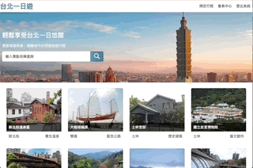
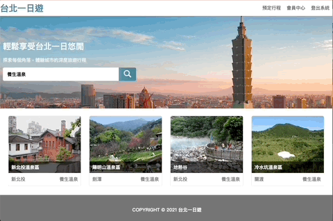
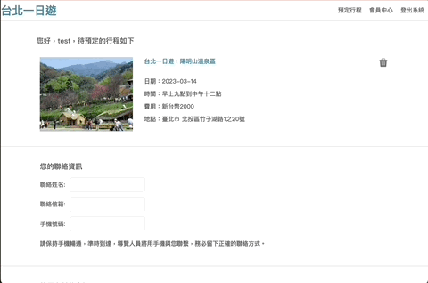

# Taipei-Day-Trip
This is a travel e-commerce website that uses a front-end and back-end separation architecture, designed according to RESTful API, and integrates payment services.
#### Web link:[https://starfruit8106.synology.me:3001/](https://starfruit8106.synology.me:3001/)
(Change to put the web onto the synology server for cost concern)

## Demo
#### Home page

#### Book a itinerary

#### Make an order

#### Member page

## Features
- RWD
- Infinite scroll tourism loading.
- Search tourist spots with implication keywords.
- carousel imgage slider.
- Travel itinerary booking.
- Integrate Tap Pay payment system.
- Check history orders in member page.
- Change member information, upload member profile picture in member page.

## Tech Stack
- Client: HTML, CSS, JavaScript, Flexbox, RWD
- Server: Python, Flask, MySQL, AWS EC2, Synology NAS

## Database Structure

- Use MySQL.
- DB normalized in 3NF.
- Foreign keys: attractions `id`, `booking_id`, `member_id`.

